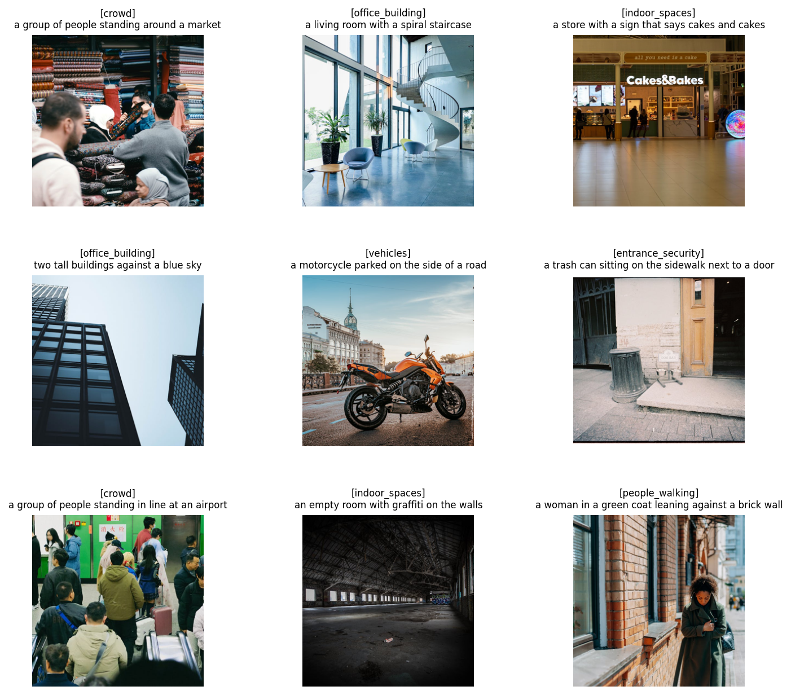

# Surveillance Image Captioning Dataset

Built a pipeline to create a 10,000+ image dataset with AI-generated captions, focused on surveillance-relevant scenes.


## What it does

1. Scrapes images from Pexels API across 12 categories like people walking, vehicles, parking lots, building entrances, night streets, crowds etc
2. Runs BLIP (vision-language model) on each image to auto-generate captions
3. Outputs a clean dataset in JSON and CSV format

## Sample Output

| Image | Caption |
|-------|---------|
| img_00001.jpg | a group of people walking down a street |
| img_00234.jpg | cars parked in a parking lot |
| img_00567.jpg | a building with a glass door entrance |
| img_01234.jpg | a city street at night with lights |

Each image gets two captions - a basic one and a more detailed one using conditional prompting.


## Categories

The 12 categories were picked to cover what surveillance cameras typically capture:

people_walking, street_scene, parking_lot, vehicles, office_building, indoor_spaces, crowd, entrance_security, night_surveillance, traffic_vehicles, security_camera_view, outdoor_areas

## How to run

### Setup

```
pip install torch torchvision --index-url https://download.pytorch.org/whl/cu124
pip install transformers Pillow requests matplotlib
```

### Step 1 — Scrape images

Get a free API key from [Pexels](https://www.pexels.com/api/), put it in the script, and run:

```
python scrape.py
```

Takes 2-3 hours. Downloads ~10k images into `images_hq/` folder.

### Step 2 — Generate captions

```
python caption.py
```

Takes about 2 hours on a GPU. Generates `dataset_with_captions.json`.

### Step 3 — Explore the dataset

Open `notebook.ipynb` to see analysis — caption length distribution, uniqueness stats, common words, and sample images with captions.

## Dataset stats

- **10,617** images across 12 categories
- **21,234** captions (2 per image)
- Average caption length: ~8 words
- Images sourced from Pexels (free, commercially licensed)
- Captions generated using Salesforce/blip-image-captioning-base

## Project structure

```
├── scrape.py                    # image scraping from pexels
├── caption.py                   # caption generation using BLIP
├── notebook.ipynb               # analysis and visualizations
├── images_hq/                   # downloaded images
├── image_metadata_hq.json       # image metadata (source, category, size)
├── dataset_with_captions.json   # final dataset with captions
└── dataset_with_captions.csv    # same in csv format
```

## Built with

- **PyTorch** — running BLIP on GPU
- **HuggingFace Transformers** — pretrained BLIP model
- **Pexels API** — image source
- **Pillow** — image processing
- **matplotlib** — visualizations

## Notes

- Started with medium size images from Pexels but they were too small (20-30kb). Switched to large size for better quality
- Some categories produce similar captions since the images look alike. Could improve with more diverse queries or different prompting strategies
- Pipeline is scalable — just add more search queries to get more images
